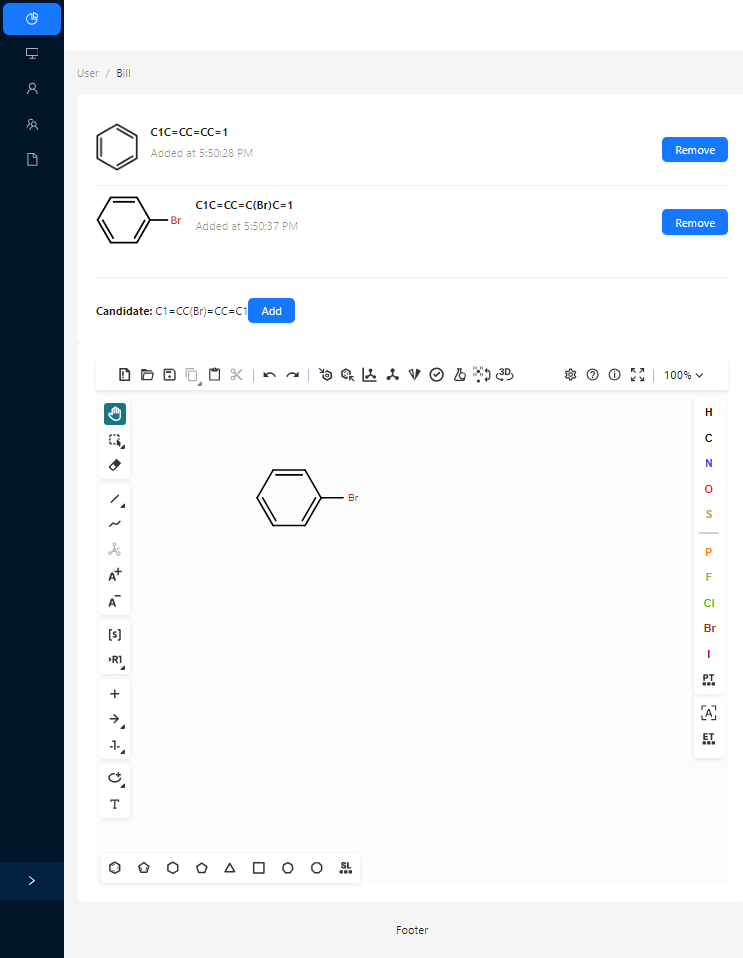

# Ketcher + Vite + Typescript + Antd

This repo shows a proof of concept of using [ketcher](https://github.com/epam/ketcher) with [ViteJS](https://vitejs.dev).

The instructions from ketcher-react assumes a different bundler so getting it working for Vite wasn't trivial.

Some extra work are needed to make the library work with vitejs

1. It assumes `process.env` is available. This has to be configured in vite.config.ts
2. It does not include index.css properly. This has to be added explicitly. 
3. Strict mode has to be disabled for now.
4. In a non full screen setting, the bottom toolbar can be misaligned.

# Goals

I want to demonstrate the following:

* A wrapper component for the editor taking an initial value and a callback for the editor.
* Be able to reuse the editor and dynamically change the molecule shown.

# Implementation Steps

1. I started with `npm create vite@latest ketcherdemo -- -template react-ts`
2. I added ketcher packages following the library's instruction.
3. I added [antd](https://ant.design) as a UI framework to test rendering in a subcomponent.
4. I implemented a simple list to hold the smiles and a computed value (the image) of the drawn molecule.

# Results

I've demonstrated that it is possible to use vitejs to create a React app with the ketcher library in non full screen mode.
I've shown a proof of concept where the ketcher editor can be used to build and edit a list of molecule.

What I've also noticed is the bundled js is quite huge, with a gzipped size of about 7MB. 
There are also still some rough edges such as https://github.com/epam/ketcher/issues/4126 where the hand cursor is rendered incorrectly in non full screen mode.